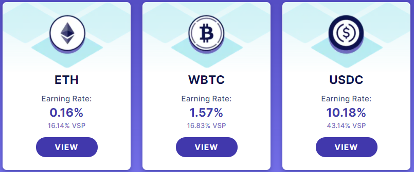

## Strategies
- ETH
- WBTC
- USDC



# Tests
## WBTC + WETH
WBTC and WETH strategies are on `v0.3.5` on the **master** branch.  
First run `git checkout master`:
- Live vault tests
```
brownie test tests/wbtc_live/test_operation.py
brownie test tests/weth_live/test_operation.py
```
- Clone test
```
brownie test tests/clone/test_clone_and_apr.py
```
- APR test
```
brownie test tests/test_apr.py -s
```
## USDC
USDC strategy is on `v0.3.0Edited` on the **downgrade030** branch.
First run `git checkout downgrade030`:
- Live vault tests
```
brownie test tests/usdc_live/test_operation.py
```
- Clone test
```
brownie test tests/clone/test_clone_and_apr.py
```
- APR test
```
brownie test tests/test_apr.py -s
```